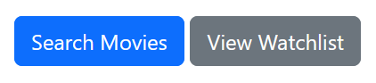
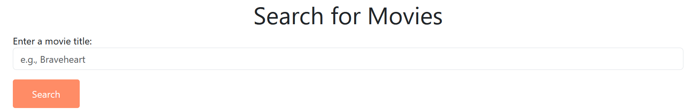
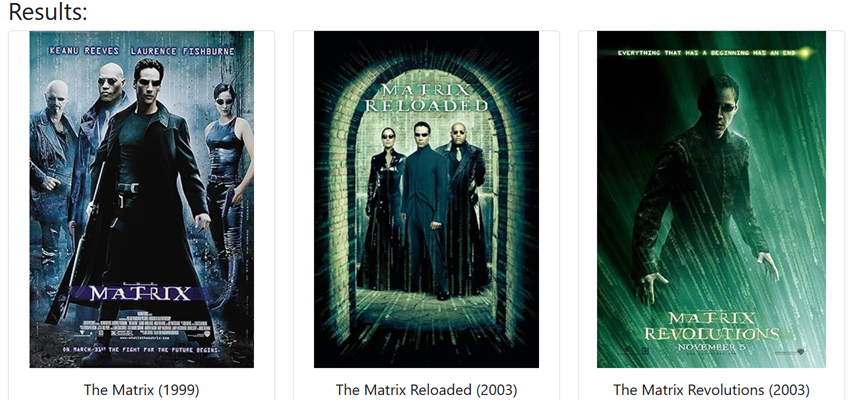
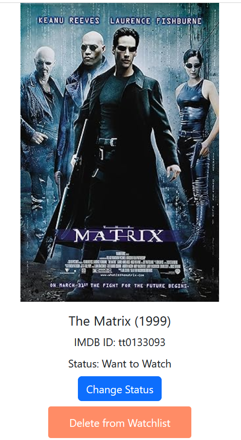
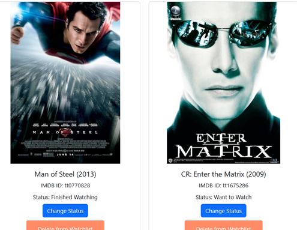
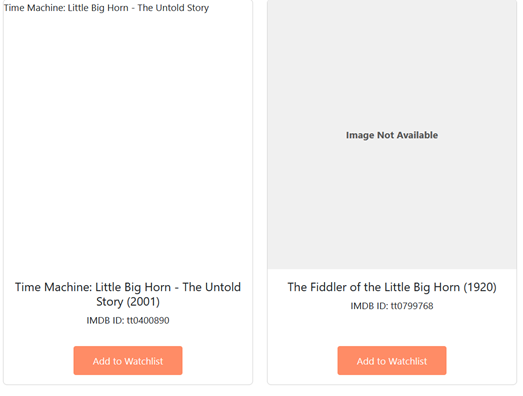
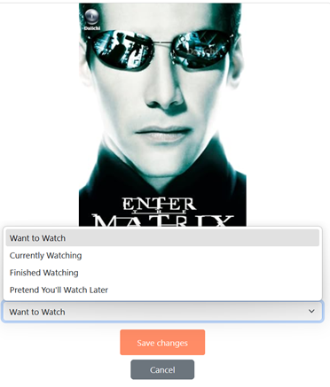
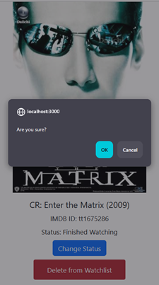

# Movie Watchlist
### Version 1.0.0

## Description
This is a movie tracker app for course final. With it, users can search movies and add them to their watchlist where they will be able to edit the status of a film. The app is intended for filmgoers who view more movies in a year than they can remember.

## To Start
* Navigation occurs through the navigation bar, progressing through the buttons, or through the browser's back or forward buttons.

1. **Search or View Watchlist?**  
Users will select to search for a film by title or view their watchlist. The watchlist for first-time users will be empty.

2. **Search**  
Users will input a film title (ex., Aquaman) in the search bar and either press "Search" or hit "Enter" on their keyboard (either works!).

3. **Results**  
Returns a list of all film titles matching their search query (ex., Aquaman).

4. **Adding to Watchlist**  
Pressing "Add to Watchlist" will add the selected film to the user's watchlist.

## The Watchlist
The watchlist displays all the films users have added to it (like adding to a shopping cart!). From the watchlist, users will be able to edit or delete their films.

### Note: Each film card displays:
- A unique poster (if present)   
> **NOTE:** Not all movies have corresponding posters. Those that do not will display "Image Not Available". Some movies have posters but they come from a separate origin. For safety, those images are blocked and not rendered. This shows a blank space instead of an image or an "Image Not Available" placeholder.

- Title + Year
- A unique IMDB ID number
- Status (set by the user)

### Editing
1. Pressing the "Change Status" will allow the user to select 1 of 4 options from a dropdown menu:
- "Want to Watch"
- "Currently Watching"
- "Finished Watching"
- "Pretend You'll Watch Later" (i.e., you know you really don't want to watch it!)

2. When the desired status is selected, users can opt to save the change or cancel the edit.
- **Saving:** Updates status in the database and returns user to their watchlist.
- **Cancels:** Does NOT update status and returns user to their watchlist.

### Deleting
Deleting is simple! Pressing the "Delete from Watchlist" button will:
1. Result in a confirmation prompt  
if "ok"...
2. Removal of the film from the watchlist 

## Under the Hood
This app leverages:
- **Node.js:**  
Handles Javascript runtime for backend processes (ex., logic and API requests).
- **Express:**  
For structure and router handling.
- **MongoDB:**  
NoSQL database to store movie and user data.
- **Mongoose:**  
Object Data Modeling (ODM) library for MongoDB, makes structuring data and queries easier.
- **Handlebars:**  
Rendering template to display data from the database.
- **Bootstrap:**  
Frontend framework for responsive styling and design.
- **OMDb API:**  
No-cost external API to provide movie data.

Following Models, Views, and Controllers (MVC), the app is capable of directly interacting with MongoDB, rendering handlebar logic, and processing and passing requests. Data itself is stored both locally and on MongoDb Atlas (Mongo on the cloud).

## OMDb API
As the app requires the OMDb API, it can be accessed at:
- [OMDb](https://www.omdbapi.com/)

## License
- MIT License
